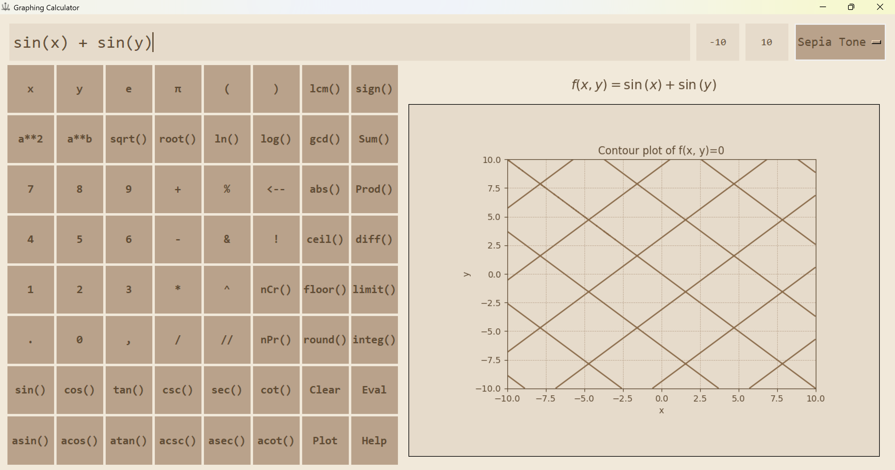

# Graphing Calculator (Tkinter + SymPy)

**Graphing Calculator** is a Python GUI application built with **Tkinter** and **SymPy**.  
It allows you to evaluate a wide range of mathematical expressions—including calculus, trigonometry, combinatorics, and number theory—and plot 1D and 2D functions. Interactive help with examples and easy-to-use shortcuts make exploring math functions intuitive and fast.

---

## Features

- **Expression Evaluation**: Arithmetic, trigonometry (`sin`, `cos`, `tan`, `sec`, `cosec`, etc.), calculus (`diff`, `integrate`, `limit`, `Sum`, `Product`), combinatorics (`nCr`, `nPr`, `!`), and number theory (`lcm`, `gcd`, `abs`, `round`, etc.).
- **1D & 2D Plotting**:
  - 1D: `f(x)` functions.
  - 2D: Implicit functions like `x**2 + y**2 - 1` (circle) using contour plots.
- **Constants & Special Functions**: Supports `π`, `e`, `log(a,b)`, `sqrt`, and more.
- **Interactive Help**: Markdown-based help with clickable example buttons.
- **History & Undo**: Keep track of previous inputs and undo mistakes.
- **Keyboard Shortcuts & Quick Buttons**: Built-in buttons for common expressions and operations.

---

## How to Use

1. **Enter an Expression** in `x` and `y`: Use the in-built buttons or type using the keyboard.
2. **Set the Domain**: By default, the domain is set to `[-10, 10]`. Change it from the top-right corner if needed.
3. **Evaluate**: After inserting the expression, click the `Eval` button to simplify it. The result will appear in the label above the graph.
4. **Plot**: If the expression evaluates without errors, click the `Plot` button to visualize it.
5. **Help**: Click the `Help` button for guidance and interactive examples.

---

## Requirements

The following Python packages are required to run this application:

- `Python >= 3.10`
- `tkinter`
- `sympy`
- `numpy`
- `matplotlib`
- `Pillow`
- `tkinterweb`
- `markdown`

You can install the Python packages using `pip`:

```bash
pip install sympy numpy matplotlib Pillow tkinterweb markdown

OR

```bash
pip install -r requirements.txt
